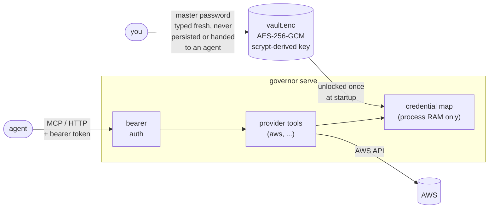

# governor

**Governor gives AI agents safe access to your production resources.**

It's a local MCP server that stands between an agent and your cloud credentials. The agent talks to governor over
HTTP/MCP and gets back data — it never sees an access key, a secret, or the master password that protects them.

[](LICENSE)
[](https://bun.sh)
[](https://www.typescriptlang.org/)

## Why

Giving an autonomous agent your `AWS_SECRET_ACCESS_KEY` means giving it everything that key can do, forever, with no
record of what it actually used. Most setups today do exactly that — the credential sits in an env var or a config file
the agent's shell can read directly.

Governor changes the shape of the problem: credentials live encrypted at rest, are decrypted once into the memory of a
process the agent never controls, and are exposed to the agent only through a fixed set of narrow, audited tools (list
buckets, search objects, get a time-limited presigned URL — never "run arbitrary AWS API call").

## How it works



- **`governor init`** creates an encrypted vault (`.governor/vault.enc`) and sets a master password. AES-256-GCM,
  scrypt-derived key at OWASP's strongest listed parameters.
- **`governor setup <provider>`** stores that provider's credentials in the vault — encrypted the moment they're typed,
  never written to disk in plaintext.
- **`governor serve`** unlocks the vault once, holds decrypted credentials only in that process's memory, and exposes
  them to agents solely through MCP tools and a small REST surface — never as raw key material.
- Every tool call is bearer-token authenticated and audit-logged (tool name, outcome, duration).

### The threat model, precisely

Governor's guarantee rests on one fact: **the master password is typed fresh into governor's own prompt and is never
written anywhere** — not to disk, not into an env var an agent's shell can read, not into a file an agent could
exfiltrate. An agent that fully controls the calling shell can still only reach governor through its HTTP tools, which
is the whole point.

This is also why governor doesn't use the OS keychain (macOS Keychain, Linux Secret Service, Windows DPAPI): all three
gate access by OS _user_, not by _calling process_ — a shell an agent controls can read them exactly as easily as
governor can. We verified this empirically before ruling it out.

What governor deliberately does **not** do: run as a separate OS service/service-account to sandbox itself from the
agent process. That would add a real, kernel-enforced boundary, but turns `governor serve` from
"a command you run" into "infrastructure you install," differently on every OS. The vault + never-persisted-password
design gets an equivalent guarantee without that operational cost.

## Quick start

```sh
bun install

# 1. Create the encrypted vault and set a master password
bun run cli init

# 2. Store AWS credentials in it
bun run cli setup aws
# AWS Access Key ID: ...
# AWS Secret Access Key: ...
# Master password: ...

# 3. Start the MCP server (loopback-only by default)
bun run cli serve
# Governor MCP endpoint listening on http://127.0.0.1:8787
# Generated a one-time MCP bearer token for this run: <token>
```

Point an MCP-capable agent at `http://127.0.0.1:8787/mcp` with header
`Authorization: Bearer <token>`, and it can now call governor's tools — without ever seeing an AWS credential.

Or build a standalone binary:

```sh
bun run build          # -> ./dist/governor
./dist/governor --help
```

## CLI reference

| Command                     | Description                                                                                                                                                     |
| --------------------------- | --------------------------------------------------------------------------------------------------------------------------------------------------------------- |
| `governor init`             | Create the encrypted vault and set the master password.                                                                                                         |
| `governor setup <provider>` | Store credentials for a provider. `--profile <name>` to use a named profile (default `"default"`); `--list` to list configured profiles.                        |
| `governor rotate-password`  | Re-encrypt the vault under a new master password — the standard remediation if the old one may be compromised. Also upgrades the vault's KDF params to current. |
| `governor serve`            | Start the MCP endpoint. `--host` (default `127.0.0.1`), `--port` (default `8787`).                                                                              |

`serve` reads its bearer token from `GOVERNOR_MCP_TOKEN` if set, otherwise generates one and prints it once at startup.
In non-interactive contexts (no TTY — CI, cron), the vault password comes from `GOVERNOR_MASTER_PASSWORD`
instead of a prompt. If no vault exists at all, providers fall back to their standard environment variables (e.g.
`AWS_ACCESS_KEY_ID` /
`AWS_SECRET_ACCESS_KEY`).

## Providers

### AWS (`aws`)

Auth method: access key (`AWS_ACCESS_KEY_ID` / `AWS_SECRET_ACCESS_KEY`) — chosen over SSO specifically so
`governor serve` works unattended in CI and cron, not just interactive sessions.

MCP tools:

| Tool                          | Does                                                                                                                                                            |
| ----------------------------- | --------------------------------------------------------------------------------------------------------------------------------------------------------------- |
| `aws_list_profiles`           | Lists AWS profiles connected to this governor instance.                                                                                                         |
| `aws_get_caller_identity`     | STS `GetCallerIdentity` for a profile — account id, ARN, user id.                                                                                               |
| `aws_s3_list_buckets`         | Lists every S3 bucket visible to a profile, with region and creation date.                                                                                      |
| `aws_s3_search_objects`       | Lists/searches objects in a bucket by prefix and/or substring — key, size, last-modified, etag. Never returns object contents.                                  |
| `aws_s3_get_download_url`     | Returns a time-limited, read-only presigned download URL for one object — never the bytes or credentials.                                                       |
| `aws_rds_instance_query`      | Runs one SQL statement against an RDS/Aurora database over an SSM tunnel through a bastion, authenticated with a short-lived IAM DB token — no stored password. |
| `aws_dynamodb_list_tables`    | Lists every DynamoDB table visible to a profile in a region.                                                                                                    |
| `aws_dynamodb_describe_table` | Table status, item count, size, primary key schema, and global secondary indexes.                                                                               |
| `aws_dynamodb_get_item`       | Fetches a single item by its exact primary key.                                                                                                                 |
| `aws_dynamodb_query_table`    | Runs a DynamoDB Query (partition key, optional sort-key condition/index/filter) — paginates internally up to `maxItems`.                                        |
| `aws_dynamodb_scan_table`     | Runs a DynamoDB Scan across a table/index with an optional filter — use only when the partition key isn't known.                                                |

REST:

| Route                                  | Does                                       |
| -------------------------------------- | ------------------------------------------ |
| `GET /providers/aws/identity`          | Caller identity for the `default` profile. |
| `GET /providers/aws/:profile/identity` | Caller identity for a named profile.       |

Every S3 tool takes an optional `region` — it's a starting guess, not a requirement; a wrong one is caught via S3's
region-redirect response and retried automatically against the bucket's real region.

Adding a provider means implementing `ProviderPlugin` (see
`src/providers/plugin.ts`) in `src/providers/<name>/` and adding one entry to `PROVIDER_PLUGINS` in
`src/providers/index.ts` — `serve`, the MCP server, and `setup` all work generically off that list.

## Security notes

- The vault file (`.governor/vault.enc`) is created `chmod 0600` and is gitignored by default — never commit it.
- `serve` binds to `127.0.0.1` unless you explicitly pass `--host` to widen it — the MCP and provider endpoints aren't
  reachable from the network by default.
- `/mcp` and every `/providers/*` route require
  `Authorization: Bearer <token>`; failed attempts are logged (path and method only — never the attempted token).
- Presigned URLs are capped at 1 hour and default to 5 minutes.
- See [`CLAUDE.md`](CLAUDE.md) for the full set of conventions and the reasoning behind the vault's crypto design.

## Development

```sh
bun install
bun run cli <command>     # run the CLI from source
bun test                  # run tests
bun run format             # prettier --write .
```

## Roadmap

- One-shot `audit` / `check` commands for scripted, non-interactive posture checks.
- Additional providers beyond AWS.

## License

[Apache 2.0](LICENSE)
